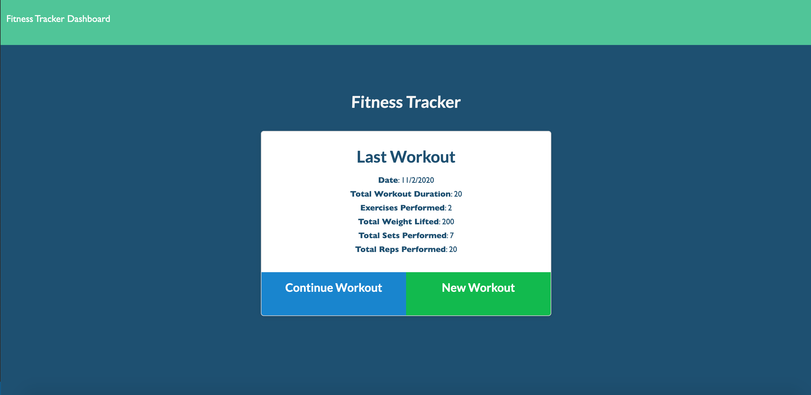

  # Workout Tracker  
  
***
 
  ## Description

    A workout tracking app using MongoDB.
***

  ## Table of Contents

  * [Description](#description)
  * [Installation](#installation)
  * [Usage](#use)
  * [Contributors](#contributors)
  * [Contact Information](#email)
  * [License](#license)
***

  ## Installation

    To install necessary dependencies, run the following command:
  
     npm install
***
  ## Usage

     node server.js
***
  ## Contributors

     Jon Misner
***
  ## Contact Information

     JonMisner on Github or jonmisner86@gmail.com
***
    ### License: MIT
***  
